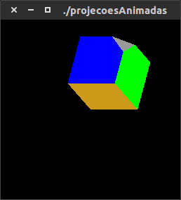

= COMPUTAÇÃO GRÁFICA 2015.2
:source-highlighter: prettify
:sectnums:
:sourcedir: ex/
:toc: right
:linkattrs:
Discente
Hanoch Griner <eugriner@gmail.com>

Esse relatório contém a resolução dos exercícios referentes ao tutorial de OpenGL do docente Agostinho Brito.
http://agostinhobritojr.github.io/tutoriais/opengl/

O relatório esta dividido em tópicos seguindo a estrutura do tutorial. Cada tópico contém: questão, seguida do código fonte desenvolvido/adaptado para resolver a questão e por último a imagem ou imagens geradas na execução do código.

Para compilar e executar qualquer arquivo desse relatório deve-se colocar o arquivo Makefile na mesma pasta do arquivo .c desejado e executar o seguinte comando:

----
$ make arquivodesejado && ./arquivodesejado
----

Exemplo

.Arquivos:

* link:ex/Makefile[Makefile, window="_blank"]
* link:ex/teste.c[teste.c, window="_blank"]

.Comando:
----
$ make teste && ./teste
----

Lembre-se que você precisa ter o GLUT e um compilador C/C++ no seu computador, caso não de certo, siga as instruções do link:http://agostinhobritojr.github.io/tutoriais/opengl/conceitos-iniciais.html#compilando-programas[tutorial do professor, window="_blank"].

== Conceitos iniciais

=== Quadrados 4

==== Questão

Utilizando o programa teste-make.c como referência, implemente um programa quadrados4.c. Este programa deverá desenhar numa janela com fundo branco, de dimensões 256x256 pixels, e quatro quadrados de cores diferentes arranjados na janela.

.Arquivos:
* link:ex/1/teste-make.c[teste-make.c, window="_blank"]
* link:ex/1/quadrados4.c[quadrados4.c, window="_blank"]

==== Código

[source,c++]
----
include::{sourcedir}/1/quadrados4.c[]
----

==== Imagem

image::ex/1/quadrados4.png[]

=== Quadrados Color

==== Questão

Utilizando o programa teste-make.c como referência, implemente um programa quadradoscolor.c. Este programa deverá desenhar numa janela com fundo branco, de dimensões 256x256 pixels, um quadrado com as mesmas dimensões do quadrado original. Entretanto, cada uma das cores determinadas para os quatro vértices do quadrado deverão ser determinadas a partir de valores calculados via modelo HSI. Implemente um temporizador para os valores de H mudarem com o tempo para os vértices, produzindo uma pequena animação. Comente a linha glShadeModel(GL_FLAT) para que o feito de degradê possa ser visualizado.

.Arquivos:
* link:ex/1/teste-make.c[teste-make.c , window="_blank"]
* link:ex/1/quadradosColor.c[quadradosColor.c, window="_blank"]

==== Código

[source,c++]
----
include::{sourcedir}/1/quadradosColor.c[]
----

==== Imagem

== Desenhando linhas e pontos

=== Quadrado

==== Questão

Utilizando o programa linha.c como referência, implemente um programa quadrado.c. Este programa deverá desenhar numa janela com fundo branco, de dimensões 256x256 pixels, um quadrado vermelho, com vértice superior esquerdo de coordenadas (x, y)= (30, 226) e vértice inferior direito de coordenadas (x, y) = (226, 30). Quando a tecla a (keycode=97) for pressionada, o quadrado deverá ficar com a cor azul. Quando a tecla v (keycode=118) for pressionada, o quadrado deverá voltar à cor vermelha.

.Arquivos:
* link:ex/2/linha.c[linha.c , window="_blank"]
* link:ex/2/quadrado.c[quadrado.c, window="_blank"]

==== Código

[source,c++]
----
include::{sourcedir}/2/quadrado.c[]
----

==== Imagem

image::ex/2/quadrado1.png[]

=== Bresenham Linha

==== Questão

Implemente o algoritmo de Bresenham para traçado de linhas, utilizando GL_POINTS como parâmetro da função glBegin(). Este parâmetro indica que cada vértice deve ser tratado como um ponto simples. Utilizando o algoritmo implementado, desenhe uma reta verde do ponto (x, y)=(40, 200) ao ponto (x, y)=(200, 10).

.Arquivos:
* link:ex/2/bresenhamLinha.c[bresenhamLinha.c, window="_blank"]

==== Código

[source,c++]
----
include::{sourcedir}/2/bresenhamLinha.c[]
----

==== Imagem

image::ex/2/bresenhamLinha.png[]

=== Bresenham Círculo

==== Questão

Implemente o algoritmo de Bresenham para traçado de circunferências, utilizando GL_POINTS como parâmetro da função glBegin(). Utilizando o algoritmo implementado, desenhe uma circunferência azul de raio r=50, centrada no ponto (x, y) = (128, 128).

.Arquivos:
* link:ex/2/bresenhamCircle.c[bresenhamCircle.c, window="_blank"]

==== Código

[source,c++]
----
include::{sourcedir}/2/bresenhamCircle.c[]
----

==== Imagem

image::ex/2/bresenhamCircle.png[]

== Preenchimento de regiões

=== Seleção

==== Questão

Utilizando o programa preenchimento.c como referência, implemente um programa selecao.c. Este programa deverá desenhar numa janela com fundo branco, de dimensões 256x256 pixels, quatro polígonos com as mesmas coordenadas dos polígonos do programa de referência. Todos os polígonos devem estar inicialmente preenchidos de amarelo e com bordas pretas. Quando o usuário clicar com o botão esquerdo do mouse dentro de um dos polígonos, a cor de preechimento deste polígono deverá mudar para uma cor aleatória. Quando a tecla b (keycode=98) for pressionada, o programa passará a mudar as cores das bordas e não mais dos fundos dos polígonos. Quando a tecla f (keycode=102) for pressionada, o programa passará a mudar as cores dos fundos dos polígonos e não mais das bordas.

.Arquivos:
* link:ex/3/preenchimento.c[preenchimento.c, window="_blank"]
* link:ex/3/selecao.c[selecao.c, window="_blank"]

==== Código

[source,c++]
----
include::{sourcedir}/3/selecao.c[]
----

==== Imagem

image::ex/3/selecao1.png[]

image::ex/3/selecao2.png[]

=== Seleção Buffer Simples

==== Questão

Repita o item anterior utilizando buffer simples e comente os resultados obtidos.

.Arquivos:
* link:ex/3/selecaoBS.c[selecaoBS.c, window="_blank"]

==== Código

[source,c++]
----
include::{sourcedir}/3/selecaoBS.c[]
----

==== Imagem

image::ex/3/selecaoBS.png[]

==== Comentário
Meus olhos destreinados não foram capazes de notar nenhuma alteração após alterar de DOUBLE para SINGLE e desabilitar o swap.

=== Padrão HG

==== Questão

Crie um padrão de preenchimento com as iniciais dos seu nome e sobre nome, por exemplo, AB, para Agostinho Brito. Implemente um programa que desenhe em uma janela de fundo branco de dimensões 300x300 pixels um hexágono com bounding box de dimensões 200x200 pixels. O hexágono deve estar centrado na tela e preenchido com cor azul, utilize este padrão de preenchimento criado.

.Arquivos:
* link:ex/3/padrao.c[padrao.c, window="_blank"]

==== Código

[source,c++]
----
include::{sourcedir}/3/padrao.c[]
----

==== Imagem

== Transformações Geométricas

=== Braço Garra

==== Questão

Utilizando o programa braco.c como referência, implemente um programa braco-garra.c. Este programa deverá acrescente ao braço robótico uma garra com três dedos, sendo um indicador, um médio e um polegar, como mostra a Figura 4.3. O usuário deverá poder rotacionar o dedo indicador com as teclas i e I, nos sentidos horário e anti-horário. Da mesma forma, as teclas p P deverão rotacionar o polegar, e teclas m M, o dedo médio do robô.

image::ex/4/Figura4.3.png[]

.Arquivos:
* link:ex/4/braco.c[braco.c, window="_blank"]
* link:ex/4/braco-garra.c[braco-garra.c, window="_blank"]

==== Código

[source,c++]
----
include::{sourcedir}/4/braco-garra.c[]
----

==== Imagem

image::ex/4/braco-garra2.png[]

=== Braço Garra 3D

==== Questão

Copie o programa braco-garra.c que você criou com o nome braco-garra-3d.c. Neste novo programa, modifique o trecho da função main() que define o modo de apresentação no GLUT. Use a seguinte chamada para a função de inicialização: glutInitDisplayMode (GLUT_DOUBLE | GLUT_RGB | GLUT_DEPTH), pois inclui o tratamento de profundidade e de superfícies escondidas no OpenGL . Além disso, ao invés de utilizar chamadas à função glutWireCube(), inclua chamadas apenas à função glutSolidCube(), que contém os mesmos argumentos. Acrescente à função init() as chamadas de função glEnable(GL_DEPTH_TEST); e glEnable(GL_CULL_FACE);, de modo que o tratamento de superfícies escondidas seja feito pelo OpenGL. Utilize cores diferentes para cada uma das partes do braço, de modo a obter um modelo semelhante ao da Figura 4.4. Possibilite também que a base do robô seja rotacionada em torno do eixo y, usando as teclas b e B, para girar nos sentidos horário e anti-horário.

.Arquivos:
* link:ex/4/braco.c[braco-garra.c, window="_blank"]
* link:ex/4/braco-garra.c[braco-garra-3d.c, window="_blank"]

==== Código

[source,c++]
----
include::{sourcedir}/4/braco-garra-3d.c[]
----

==== Imagem

image::ex/4/braco-garra-3d3.png[]

== Projeções geométricas

=== Tipos de Projeções

==== Questão

Utilizando o programa projecoes.c como referência, implemente um programa tiposdeprojecoes.c. Este programa deverá conter mais sete opções de teclado: t e f, para exibir o topo e o fundo do objeto, F e T, para mostrar a frente e a face traseira, e e d, para mostrar a faces esquerda e direita, respectivamente, e a tecla c, para mostrar o triângulo do canto.

.Arquivos:
* link:ex/5/projecoes.c[projecoes.c, window="_blank"]
* link:ex/5/tiposdeprojecoes.c[tiposdeprojecoes.c, window="_blank"]

==== Código

[source,c++]
----
include::{sourcedir}/5/tiposdeprojecoes.c[]
----

==== Imagem

image::ex/5/tiposdeprojecoes1.png[]

=== Projeções Animadas

A função glutIdleFunc() é usada pelo GLUT para realizar operações em segundo plano ou animações, enquanto não recebe eventos de sistema. O seu protótipo é:

void glutIdleFunc(  *func);
void *func(void);

Tomando como base o programa projecoes.c, utilizando a função glutIdleFunc() e crie uma função de retorno idle(). Nesta função, os valores dos ângulos eixox e eixoy devem ser incrementados de valores constantes pequenos e diferentes, de modo a possibilitar uma animação. Utilize a função usleep() para introduzir retardos entre as apresentações dos quadros da animação, tornando mais agradável a visualização. Mantenhas as teclas o e p para chavear entre projeções ortogonais e de perspectiva.

.Arquivos:
* link:ex/5/projecoes.c[projecoes.c, window="_blank"]
* link:ex/5/projecoesAnimadas.c[projecoesAnimadas.c, window="_blank"]

==== Código

[source,c++]
----
include::{sourcedir}/5/projecoesAnimadas.c[]
----

==== Imagem

image::ex/5/projecoesAnimadas2.png[]

== Curvas no plano

=== Funcionalidades

==== Questão

Comente as funcionalidades das curvas de Bézier e NURBS utilizadas neste exemplo.

.Arquivos:
* link:ex/6/splines2d.c[splines2d.c, window="_blank"]

==== Código

[source,c++]
----
include::{sourcedir}/6/splines2d.c[]
----

==== Imagem
[[bezier]]
.Bézier

[[nurbs]]
.NURBS

==== Comentário

A curva de Bézier é uma curva polinomial expressa como a interpolação linear entre alguns pontos representativos, chamados de pontos de controle. Ela foi desenvolvida em 1962 e seu nome é devido a quem publicou o primeiro trabalho sobre a curva, o francês Pierre Bézier, funcionário da Renault, que a usou para o design de automóveis. Ela foi estruturada a partir do algoritmo de Paul de Casteljau, da Citroën, em 1957, e foi formalizada na década de 60 (WIKIPEDIA).
São curvas suaves, mas muitas vezes aproximam-se a forma desejada, e não descrevendo esta fielmente, como em um circulo de Bézier.

A NURBS é mais flexível que Bézier podendo ser mais "nervosa" quando necessário para representar qualquer forma. Ela é altamente difundida em CADs.

É importante frizar que os dois tipos de curvas tem o objetivo de facilitar a modelagem e manipulação de curvas.

=== Splines Nurbs

==== Questão

Utilizando o programa splines2d.c como referência, implemente um programa splinesnurbs.c. Quando a tecla u for pressionada, a NURBS deverá ser desenhada utilizando um vetor de nós uniforme. Quando a tecla o for pressionada, a NURBS deverá ser desenhada utilizando um vetor de nós uniforme aberto. Quando a tecla n for pressionada, a NURBS deverá ser desenhada utilizando um vetor de nós não uniforme.

.Arquivos:
* link:ex/6/splines2d.c[splines2d.c, window="_blank"]
* link:ex/6/splinesnurbs.c[splinesnurbs.c, window="_blank"]

==== Código

[source,c++]
----
include::{sourcedir}/6/splinesnurbs.c[]
----

==== Imagem

.Uniforme

.Aberta
image::ex/6/splinesnurbs2.png[]
.Não uniforme
image::ex/6/splinesnurbs3.png[]

=== Ordem Splines Nurbs

==== Questão

Qual a influência do vetor de nós foi utilizado sobre o comportamento das curvas tipo NURBS? Comente o resultado que obteve para curvas de ordens 3 e 5.

.Arquivos:
* link:ex/6/splines2d.c[splines2d.c, window="_blank"]
* link:ex/6/splinesnurbsordem.c[splinesnurbsordem.c, window="_blank"]

==== Código

[source,c++]
----
include::{sourcedir}/6/splinesnurbsordem.c[]
----

==== Imagem
.Uniforme Ordem 3

.Uniforme Ordem 4
image::ex/6/splinesnurbsordem2.png[]
.Uniforme Ordem 5
image::ex/6/splinesnurbsordem3.png[]

==== Comentário
Quanto maior a ordem, menos flexível e suave a curva fica. O resultado fica evidente nas imagens acima.

=== Comparação

==== Questão
Compare curvas de Beziér com NURBS considerando ordens iguais para ambas as curvas.

==== Comentário
É possível verificar que <<bezier>> é mais suave, uma interpolação do ponto inicial ao final sofrendo interferencia dos vertices de controle. E <<nurbs>> tem uma influencia forte dos vertices controle sendo muito mais maleável.

== Superfícies no espaço

=== Spline Inter

==== Questão
Utilizando as técnicas de seleção de objetos apresentadas no Capítulo [superficies-espaco], implemente um programa splineinter.c que proporcione um processo de modelagem interativa para este exemplo. Quando pressionar o botão esquerdo do mouse, o usuário deverá poder movimentar os pontos da malha de controle, podendo assim controlar livremente a forma da superfície.

.Arquivos:
* link:ex/7/splines3d.c[splines3d.c, window="_blank"]
* link:ex/7/splineinter.c[splineinter.c, window="_blank"]

==== Código

[source,c++]
----
include::{sourcedir}/7/splineinter.c[]
----

==== Imagem

== Modelagem de Sólidos

=== Super Jato

==== Questão

Utilizando o programa exemplos/jato.c como referência, implemente um programa superjato.c. Caso você ainda não tenha notado, o avião a jato deste exemplo não possui uma turbina. Faça-o mais interessante, projetando essa turbina e acoplando-a à parte traseira do jato no seu novo programa. O modelo da turbina fica a seu gosto. Acrescente também dois mísseis sob as asas.

.Arquivos:
* link:ex/8/jato.c[jato.c, window="_blank"]
* link:ex/8/png_texture.h[png_texture.h, window="_blank"]
* link:ex/8/camuflagem.png[camuflagem.png, window="_blank"]
* link:ex/8/montanhas.png[montanhas.png, window="_blank"]
* link:ex/8/superjato.c[superjato.c, window="_blank"]

==== Código

[source,c++]
----
include::{sourcedir}/8/superjato.c[]
----

==== Imagem

image::ex/8/superjato1.png[]
image::ex/8/superjato2.png[]

image::ex/8/superjato4.png[]

==== Comentário

Para ligar e desligar a turbina precione a tecla 'o'.

=== Super Jato com Logo

==== Questão

Crie um logotipo utilizando um programa de manipulação de imagens de sua preferência. Salve-o no formato Iris RGB e mapeie-o na parte superior da asa, como mostra a Figura Exemplo de logotipo para o superjato.

.Arquivos:
* link:ex/8/superjato.c[superjato.c, window="_blank"]
* link:ex/8/png_texture.h[png_texture.h, window="_blank"]
* link:ex/8/camuflagem.png[camuflagem.png, window="_blank"]
* link:ex/8/montanhas.png[montanhas.png, window="_blank"]
* link:ex/8/logo.png[logo.png, window="_blank"]
* link:ex/8/superjatologo.c[superjatologo.c, window="_blank"]

==== Código

[source,c++]
----
include::{sourcedir}/8/superjatologo.c[]
----

==== Imagem

image::ex/8/superjatologo1.png[]

==== Comentário

Para ligar e desligar a turbina precione a tecla 'o'.
